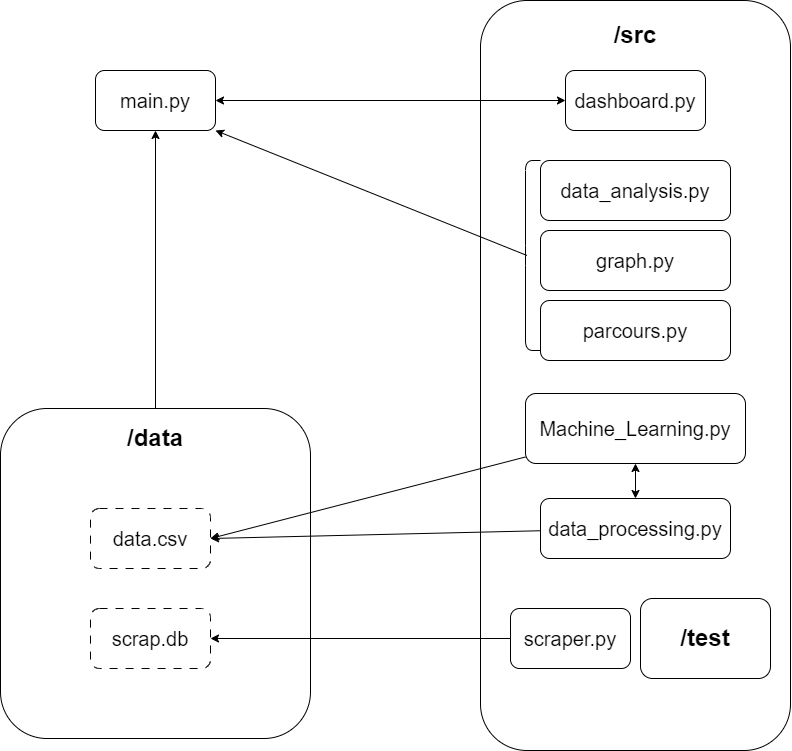

# Project X AE A-12 : FakeNews detector from a Twitter database


## Contributors

- [Sohel Dinoo](https://gitlab-cw4.centralesupelec.fr/sohel.dinnoo)
- [Alexandre Baux](https://gitlab-cw4.centralesupelec.fr/alexandre.baux)
- [Philémon Wehbe](https://gitlab-cw4.centralesupelec.fr/philemon.wehbe)
- [Mathis Rouget](https://gitlab-cw4.centralesupelec.fr/mathis.rouget)
- [Zein Sakkour](https://gitlab-cw4.centralesupelec.fr/zein.sakkour)
- [Vianney Saint Georges-Chaumet](https://gitlab-cw4.centralesupelec.fr/vianney.saintgeorges-chaumet)

## Project context and description

<p style='text-align : justify'> 
    Nowadays, fake news are widely spread on social media et especially on Twitter (X). Furthermore, it is important for big companies, politicians and other renowned people to control their digital and public reputation. Therefore, our product appears as a tool for such clients to keep track and battle misinformation and could be used by unique users but also by private companies. 
    <br>
    <br>
    Our project aims to detect fake news and to rank them. Depending on its impact on other users, how viral it is and other criteria, our program allows the consumer to follow the evolution of a piece of fake news through time. 
</p>

## Needs analysis

**Tweet analysis:** 

<ul style='text-align : justify'> 
    <li> A unique user will be able to access some (limited) information about a chosen subject (free account). </li>
    <li>Companies or more widely known organizations should be able to follow the digital opinion about them (premium account).</li>
    <li> As seen higher, we could monetize our services through a subscription service to access better options (such as Twitter Blue). Free accounts will be able to have access to a limited number of requests using tweets published only recently (a week-widthspan) Premium accounts will be able to have access to unlimited requests over tweets over a longer period. </li>
</ul>

## Installation instructions
Clone the `git` repository on your computer with `git clone https`.

Install all needed packages by running `pip install -r requirements.txt`.

<!-- Download the dataset on : <span style = 'background-color : red; color : white'> insert url here </span>.

Move the `.csv` file into the folder `./data`.

Go to <span style = 'background-color : red; color : white'> insert local url here </span>. -->

## How to use the app ?
Run the app with `python main.py` in a terminal.

## Machine Learning Implementation
Our machine learning (ML) implementation focuses on predicting fake news labels and estimating probabilities for articles in a given dataset using a trained model. The key steps involve data preprocessing, model training, prediction, and updating the dataset with predictions and probabilities. <br>
The first step is loading the training dataset, which includes labeled examples of fake and real news. The labels are extracted, and the textual content is used as the input feature. We employ a TfidfVectorizer, initialized with specific parameters such as stop words and maximum document frequency, to convert the text into a numerical representation suitable for machine learning.<br>
```python
# Load the training dataset
train_df = pd.read_csv(train_csv_path)

# Extract labels for training
y_train = train_df.fake_value

# Use the entire training dataset
x_train = train_df["text"]

# Initialize a TfidfVectorizer
tfidf_vectorizer = TfidfVectorizer(stop_words="english", max_df=0.8)

# Fit and transform the training set
tfidf_train = tfidf_vectorizer.fit_transform(x_train)
```
We utilize a PassiveAggressiveClassifier, a popular algorithm for online learning scenarios. This classifier is trained on the Tfidf-transformed training data to learn the patterns and characteristics of fake and real news.<br>
```python
# Initialize a PassiveAggressiveClassifier
pac = PassiveAggressiveClassifier(max_iter=500)
pac.fit(tfidf_train, y_train)
```

Once the model is trained, it is used to predict labels and decision function scores on the dataset to be evaluated. The TfidfVectorizer is also applied to transform the text in the dataset into a suitable format for prediction.<br>
```python
# Predict on the dataset
x_test = df["text"]
tfidf_test = tfidf_vectorizer.transform(x_test)
y_pred = pac.predict(tfidf_test)
y_prob = pac.decision_function(tfidf_test)
```
The decision function scores obtained from the model are converted into probabilities. These probabilities represent the confidence of the model in assigning the "FAKE" label. The dataset is then updated with the predicted labels and corresponding probabilities.<br>
```python
# Convert decision function scores to probabilities
probabilities = 1 / (1 + np.exp(-y_prob))

# Update the dataset with predictions and probabilities
df["fake_value"] = y_pred
df["confidence"] = probabilities
df["confidence"] = pd.to_numeric(df["confidence"])

# Set "fake" value to True for rows where confidence is smaller than 0.2
for i, conf in enumerate(df["confidence"]):
    if pd.to_numeric(conf) < 0.2 and df.iloc[i, -2] == "FAKE":
        df.iloc[i, -2] = "REAL"

# Display the count of REAL and FAKE instances
real_count = np.sum(y_pred == "REAL")
fake_count = np.sum(y_pred == "FAKE")
print("REAL Count =", real_count)
print("FAKE Count =", fake_count)
```
This ML implementation provides a robust and effective way to classify news articles as fake or real based on the patterns learned during training. The update mechanism ensures that the dataset reflects the model's predictions and enables further analysis and actions based on these predictions.

### ML Model Validation

In our quest to validate the effectiveness of our machine learning model for fake news detection, we employed the LIAR LIAR PANTS ON FIRE database as a crucial reference point. The LIAR database is a well-known dataset specifically designed for fact-checking and assessing the veracity of statements. 

Leveraging this rich source of information, we meticulously curated a comprehensive training and testing set for our model. The primary objective was to ensure that our machine learning model exhibited a robust performance in distinguishing between truthful and deceptive statements. 

To rigorously evaluate the model's accuracy, we implemented a dedicated testing script named test_ML.py using the pytest framework. Allowing us to measure its accuracy and ascertain that it surpassed the 50% threshold.


## Tests

We have written Pytest files to thoroughly test our functions. The following Pytest files are available in the `src/test` directory:

- `test_data_analysis.py`: Tests for functions related to data analysis.
- `test_data_processing.py`: Tests for functions related to data processing.
- `test_ML.py`: Tests for machine learning functions.
- `test_parcours.py`: Tests for parcours-related functions.

To run the tests, you can use the following command:

```bash
pytest pytest ./src/test/test_file.py
```
### GitLab CI Pipeline
We have integrated our tests into GitLab CI to automate the testing process. The CI pipeline ensures that our tests are run automatically whenever changes are pushed to the repository. This helps maintain code quality and catch potential issues early in the development process.

You can view the status of our CI pipeline and the detailed logs on the [GitLab UI](https://gitlab-cw4.centralesupelec.fr/sohel.dinnoo/projet-groupe-1/-/pipelines/).

## Code architecture diagram


